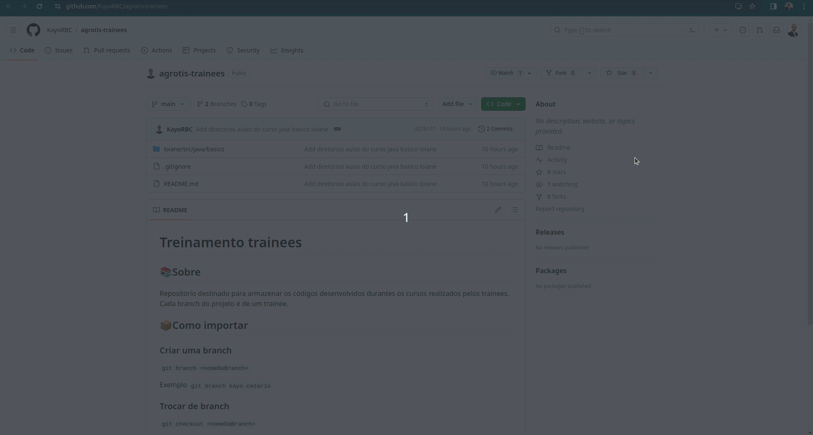

# Treinamento trainees

## 📚Sobre
Repositório destinado para armazenar os códigos desenvolvidos durantes os cursos realizados pelos trainees. Cada branch do projeto é de um trainee.

## 📦Como fazer um fork



### Criar uma branch
```git branch <nomeDaBranch>```

Exemplo
```git branch kayo.cezario```

### Trocar de branch
```git checkout <nomeDaBranch>```

Exemplo
```git checkout kayo.cezario```

## Diretórios
* ```./loiane/java``` Exercícios das aulas dos cursos de Java da <a href= "https://loiane.training">Loiane Groner</a>

Para mais informações, acesse o respectivo diretório e leia o README. 
